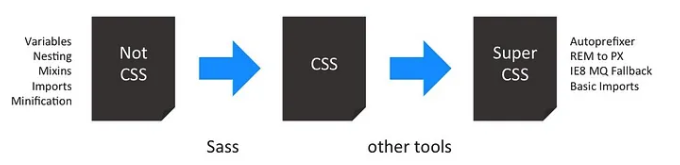

## preprocessor와 postprocessor

preprocessor에는 SASS, LESS, Stylus가 존재한다. SASS, LESS, Stylus는 언어이자 그 자체로 툴 이름이기도 하다. 이러한 툴은 css가 제공하지 못하는 기능들인 변수, Nesting, Mixin, Minification 기능등을 제공한다. SASS로 작성한 툴들은 css 파일이 아니며 css 파일로 변환돼야한다.

post processor는 autoprefixer, rem to px 등 css 파일을 변환하는 역할을 한다.

## PostCSS

자바스크립트를 이용해서 css를 변환할 수 있는 도구이다. 크게 기존 css 파일에 대해서 Parser, Plugin, Stringifier 과정을 밟아 새로운 css 파일을 생성해낸다. PostCSS는 preprocessor처럼 고유한 문법이 없다는 점에서 post processor이다.

Plugin으로는 Autoprefixer, Stylelint, CSSnano 등이 존재한다.

Plugin들과 함께 다음과 같은 기능들을 제공한다.

1. vendor prefix 자동 삽입

> 브라우저 벤더사들은 실험적인 개발을 위해 experimental하고 non standard한 css 혹은 js api 뒤에 prefix를 붙인다. 이는 웹 개발자들이 이러한 기능들에 의존하는 것을 막는다. [Vendor Prefix - MDN Web Docs Glossary: Definitions of Web-related terms | MDN](https://developer.mozilla.org/en-US/docs/Glossary/Vendor_Prefix)

2. 최신 브라우저만 이해할 수 있는 css 문법을 대부분의 브라우저가 이해할 수 있게 변환한다.

3. Stylelint를 통해 css를 잘못 사용하는 경우 에러를 로깅한다.

4. CSS nano를 통해서 css를 압축한다.

## QUESTIONS

1. tailwind와 postcss의 관계는?

[PostCSS Architecture](https://postcss.org/docs/postcss-architecture#core-structures)

[Deconfusing Pre- and Post-processing | by Stefan Baumgartner | Medium](https://medium.com/@ddprrt/deconfusing-pre-and-post-processing-d68e3bd078a3)
