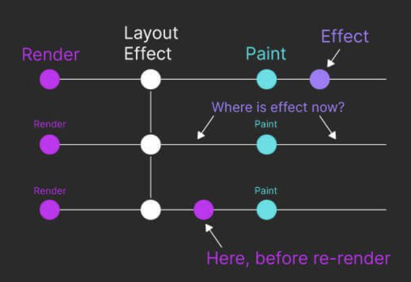

repaint 전에 실행되는 `useEffect`가 `useLayoutEffect`다.

다음 두 가지 상황에서 보통 사용된다.

1. repaint 전에 layout 계산, DOM 과 관련한 계산을 하기 위해서 사용된다.
2. 동기적인 리렌더링을 유도하기 위해서 사용된다. 즉, Flicker 현상을 방지한다.

lifecycle 메서드로 따지면 `componentDidMount`와 `componentDidUpdate`와 동일하다.

useLayoutEffect는 두 가지 인자를 전달받는다.

1. setup
2. dependency array

`useLayoutEffect`는 디펜던시가 변경되고, 클린업 함수가 호출되고, setup 함수가 호출되는 순서다.

## Caveats

1. Effect는 클라이언트에서만 실행된다. 서버에서 실행되지 않는다.
2. useLayoutEffect 내부에서 상태를 업데이트하면서 화면의 **repaint를 blocking** 할수 있다. 그러므로 과하게 사용되면 앱이 느려질 수 있으므로 가급적 useEffect를 사용하자.
3. useLayoutEffect 내부에서 상태를 변경하면 모든 Effect(useEffect 포함)를 즉시 실행한다. 이는 기존에 렌더링 이후에 실행되는 useEffect의 예외 사항이다.

## References

- [useLayoutEffect – React](https://react.dev/reference/react/useLayoutEffect)

- [Empowering React useLayoutEffect for Ultimate Performance](https://www.dhiwise.com/post/maximizing-react-uselayout-effect-for-ultimate-performance)

- [useEffect vs useLayoutEffect](https://kentcdodds.com/blog/useeffect-vs-uselayouteffect)
